# maintenance-management-system
Maintenance Management System for facility and equipment maintenance, covering asset management, work orders, preventive maintenance, sparepart inventory, maintenance KPI, MTBF, MTTR, RCA 5 Why, and maintenance reporting.

## Project Overview

This project demonstrates a structured maintenance management workflow for facility and equipment maintenance.

The system covers the process from asset registration and preventive maintenance planning to work order management, maintenance history, performance analysis, root cause analysis, and maintenance reporting.

The project combines practical maintenance documentation with a Mini CMMS dashboard to demonstrate how maintenance activities can be organized, tracked, and analyzed.

## System Scope

The maintenance management system covers the following areas:

- Asset Register & Asset Management
- Work Order Management
- Preventive Maintenance
- PM Checklist
- Sparepart Inventory
- Maintenance History
- Maintenance KPI, MTBF & MTTR
- RCA 5 Why
- Maintenance Reporting
- Mini CMMS Dashboard

  ## Maintenance Workflow

Asset Registration
        ↓
Preventive Maintenance Planning
        ↓
PM Checklist / Inspection
        ↓
Work Order
        ↓
Maintenance Execution
        ↓
Maintenance History
        ↓
KPI / MTBF / MTTR Analysis
        ↓
RCA 5 Why
        ↓
Maintenance Reporting

## Maintenance Documentation

The project includes an Excel-based maintenance documentation workbook covering:

- Asset Register
- Work Order
- Preventive Maintenance
- PM Checklist
- Sparepart Inventory
- Maintenance KPI, MTBF & MTTR
- RCA 5 Why
- Maintenance Reporting

The workbook is used as structured maintenance documentation to support asset tracking, maintenance planning, work order management, performance analysis, and reporting.

## Screenshots

Selected screenshots from the maintenance documentation workbook are provided below to demonstrate the structure and practical implementation of the system.

## Maintenance Dashboard

### Mini CMMS Dashboard
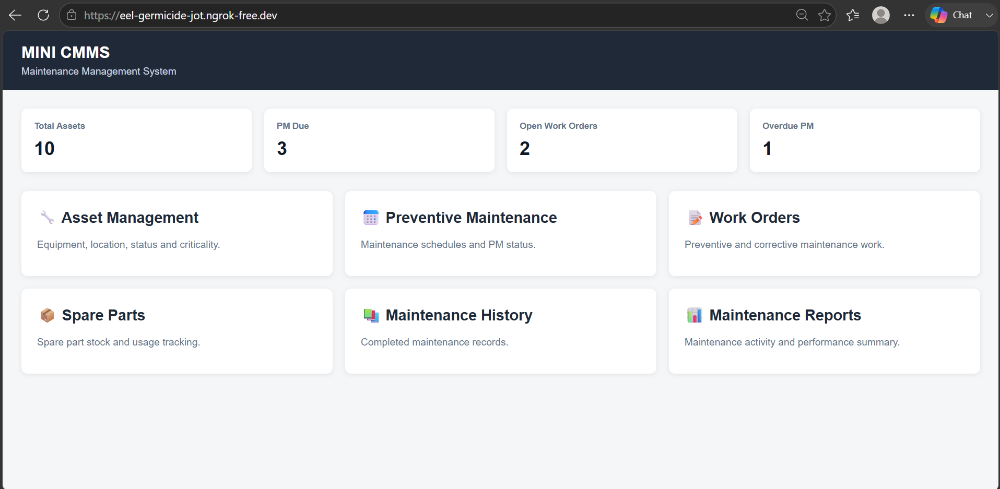

### Asset Management Dashboard
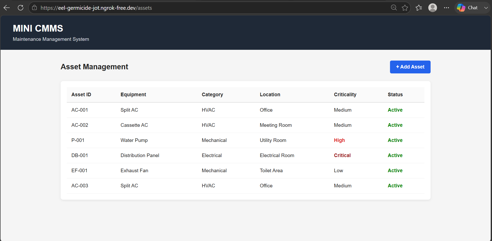

### Work Order Dashboard
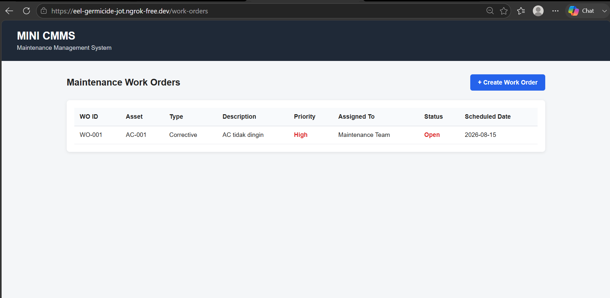

### Maintenance History
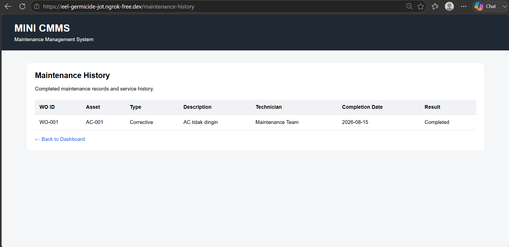

## Key Maintenance Capabilities

- Asset Register & Asset Management
- Preventive Maintenance Planning
- PM Checklist & Inspection
- Work Order Management
- Corrective Maintenance
- Maintenance History
- Spare Part Inventory
- Maintenance KPI, MTBF & MTTR
- Root Cause Analysis (RCA) – 5 Why
- Maintenance Reporting

  ### Excel Maintenance Documentation

#### Asset Register
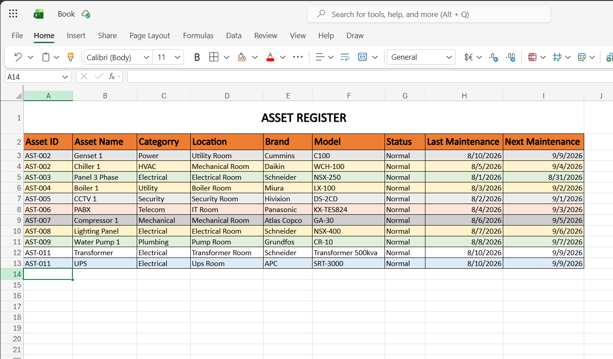

#### Work Order
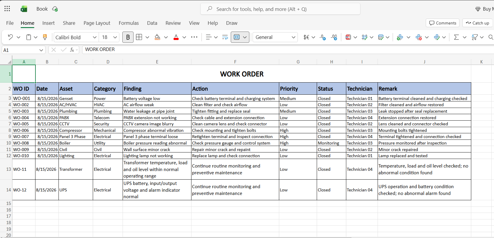

#### Preventive Maintenance
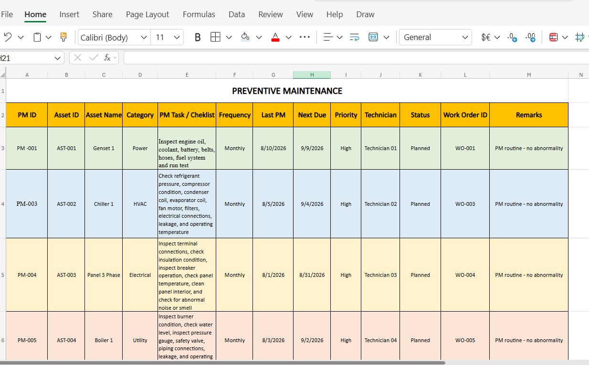

#### PM Checklist
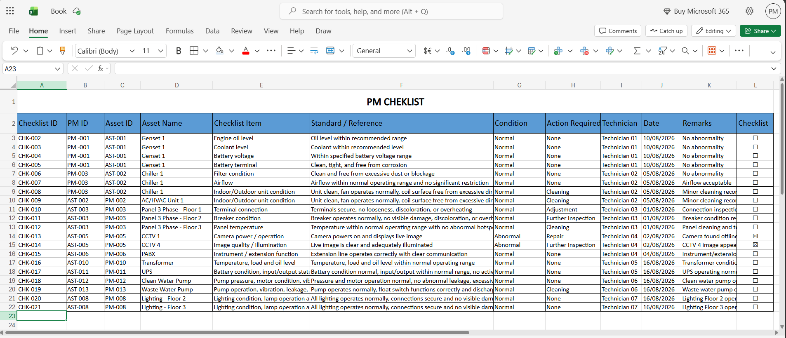

#### Sparepart Inventory
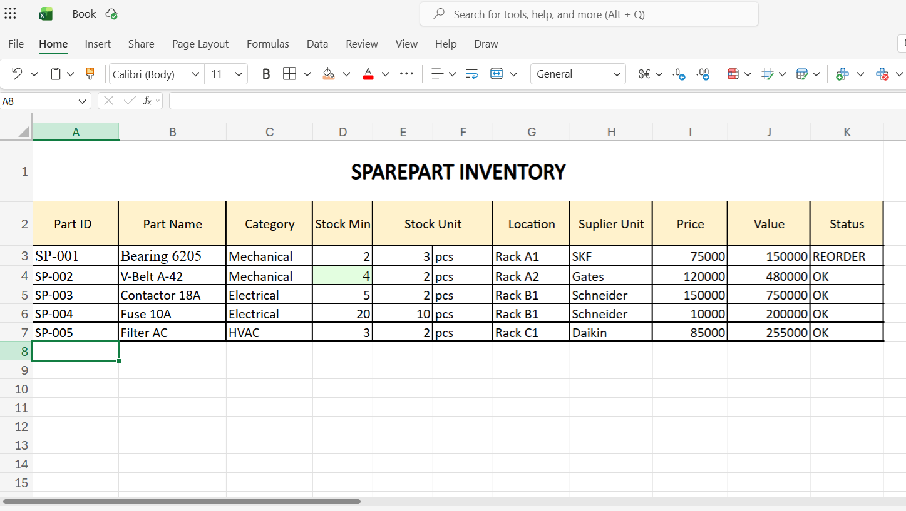

#### Maintenance KPI, MTBF & MTTR
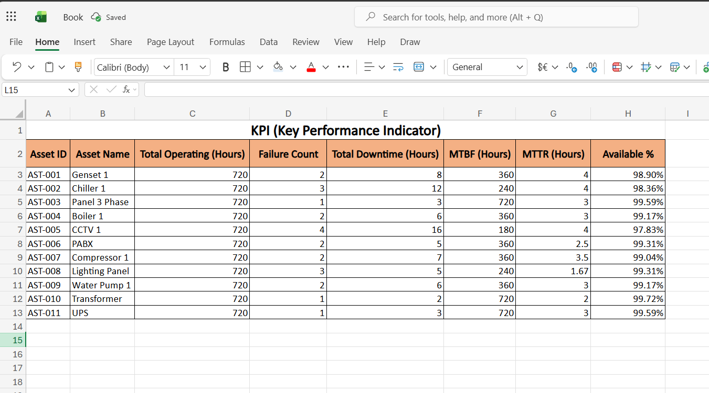

#### RCA 5 Why
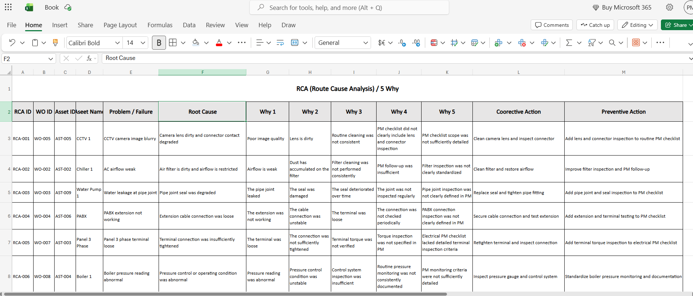

#### Maintenance Reporting
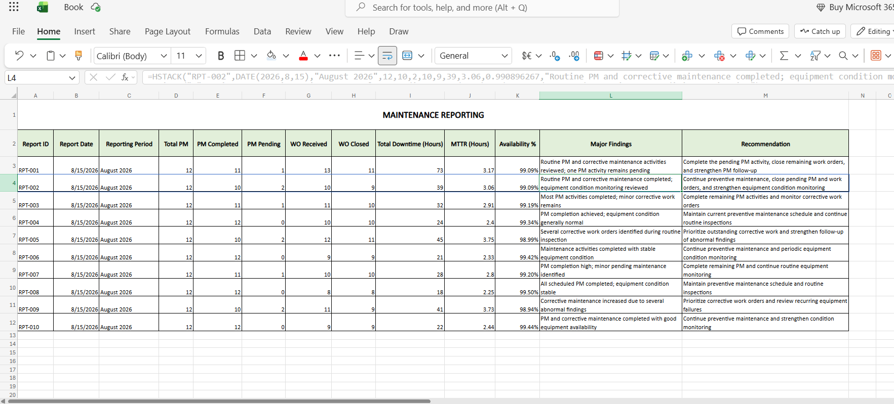

The following sections present additional maintenance-related
capabilities, including safety practices (K3) and technical
drawing using AutoCAD.

## K3 / Safety

Basic maintenance safety practices, including electrical safety,
PPE awareness, hazard identification, and safe work procedures.

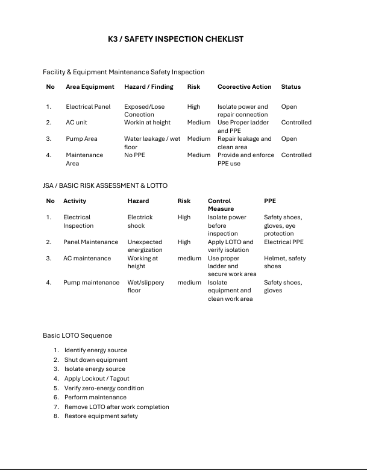

## AutoCAD 2D

Basic 2D technical drawing for maintenance documentation,
including electrical panel layouts and power distribution drawings.

### 3-Phase Electrical Panel

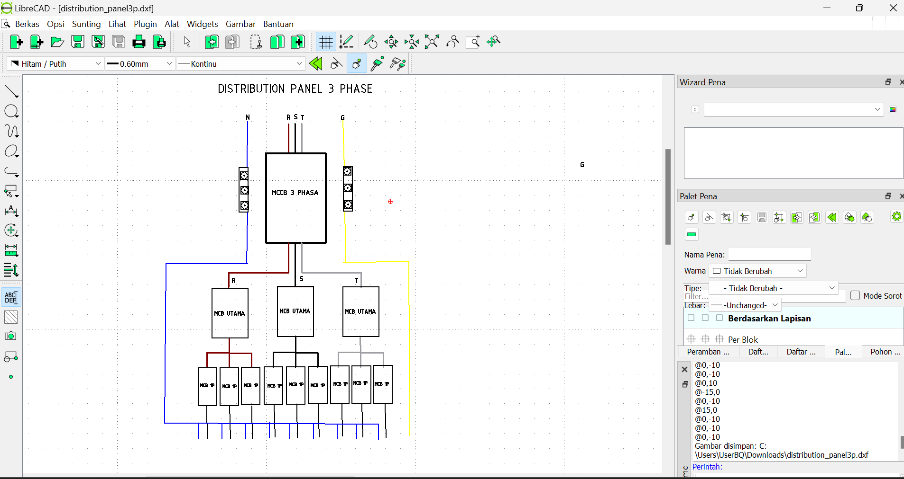

### Power Control

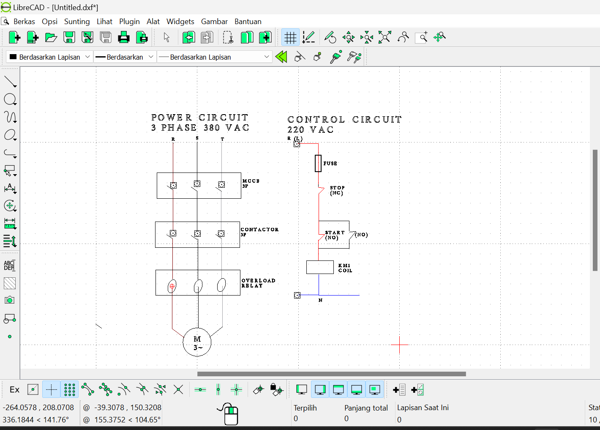
